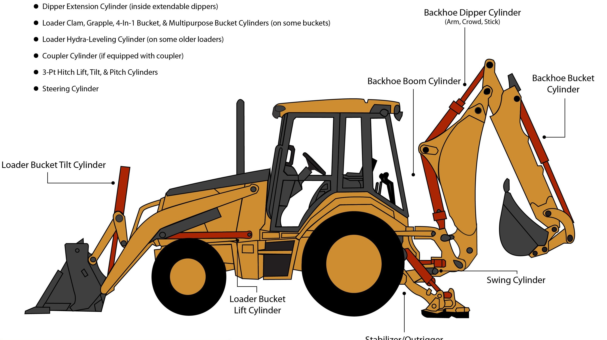

# FINAL WORKING CODE

## PS3_standalone_BT

This is the code to work on without the xbee connection .

here also you can make similar changes to switch from BT to USB . 
* BT is by default *

## PS3_easy_transfer || PS4_easy_transfer

Tested with

- Arduino Uno 
- USB HostShield
- Xbee Shield

For **USB** connection 

	USB Usb;
	//PS3USB PS3(&Usb);
	BTD Btd(&Usb);
	PS3BT PS3(&Btd);

For **BlueTooth** connection

	USB Usb;
	PS3USB PS3(&Usb);
	//BTD Btd(&Usb);
	//PS3BT PS3(&Btd);
	

	
## carCode(for the tractor)

This is the code for recieving the decoding the data thats coming from xbee (via serial)

I have attached the image of a JCB for better clarity.

 

###Tractor drive (differential drive )

	left_drive
	right_drive
	
###attachments 
	
	lift_actuator
	tilt_actuator
	boom_lift
	swing_actuator
	bucket_actuator
	

## Wiring 

 
 