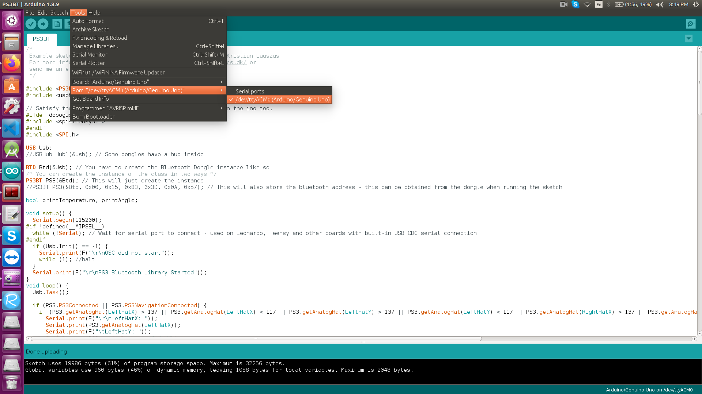
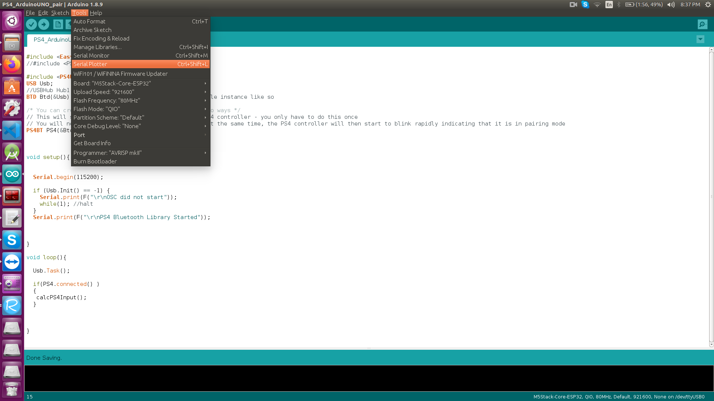

## Readme to be updated

### - Step #1

 - **Flash** the PS4_ArduinoUNO_pair code ,

#### Pairing the PS4 Controller
----------------------------------------------------
In order to pair the Bluetooth based PS4 controller with Arduino. Set the gamepad controller into pairing mode by pressing and holding the **“PlayStation button”** and **”Share button”** at the same time. Hold these two buttons until the light on the PS4 controller starts flashing rapidly. Now the Arduino should automatically detect your PS4 controller.

Once the PS4 controller is connected with your Arduino robot, the controller’s light will turn blue.

### - step #2
------------------------------------------------------------
 - **Flash** the regular code without the pair instruction 


for your referance , this is what has changed 

```
	USB Usb;
	//USBHub Hub1(&Usb); // Some dongles have a hub inside
	BTD Btd(&Usb); // You have to create the Bluetooth Dongle instance like so

	/* You can create the instance of the PS4BT class in two ways */
	// This will start an inquiry and then pair with the PS4 controller - you only have to do this once
	// You will need to hold down the PS and Share button at the same time, the PS4 controller will then start to blink rapidly indicating that it is in pairing mode
	PS4BT PS4(&Btd, PAIR);

	// After that you can simply create the instance like so and then press the PS button on the device
	//PS4BT PS4(&Btd);
```

*It also contains , the code for sending the button presses over the XBee connection .*


Once the above two steps are completed , you would see .

 


###- Step #3 
-------------------------------------------------------------------

Now that the code required for transfering the button activity and the PS controller is paired succefully , we can hook up .


**Arduino Nano with the 16channel servo module**  to the laptop/PC


Select the **correct serial port or COM port on windows**

 

Open  **serial Monitor**

  


